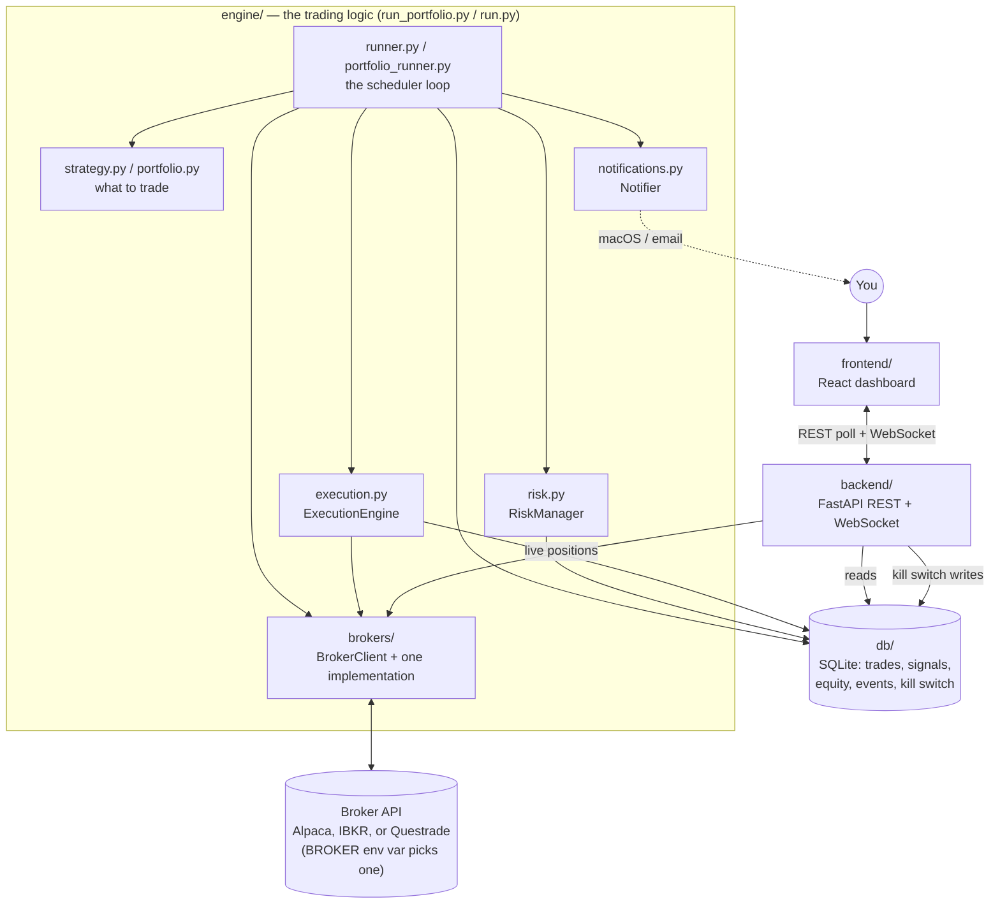

# Architecture

What each part of the codebase does and how they connect. For setup and day-to-day
usage, see [README.md](README.md).

## Overview

The engine (whichever runner you start) is the only thing that talks to the broker
for trading. The backend never places orders — it only reads history from the
database and makes one read-only live call to the broker for current positions. The
frontend never talks to the broker or the database directly — everything goes
through the backend. This keeps the loop that actually risks money small and
auditable: one path in, through `runner.py`/`portfolio_runner.py`, everything else
is observation. Which broker that path actually talks to is a `BROKER` env var away
— see below.

## `engine/` — the trading logic

### `config.py`

Loads `.env` into a single frozen `Config` dataclass — a `broker` selector, one
config block per broker, risk limits, database URL, SMTP settings. Every other
module takes a `Config` instance rather than reading environment variables itself,
so tests can construct one in-memory without touching real env vars.

Each broker's fields live alongside `broker`, not behind a shared shape:
`alpaca_api_key`/`alpaca_secret_key`, `ibkr_host`/`ibkr_port`/`ibkr_client_id`,
`questrade_refresh_token` are three genuinely different auth models (API key pair,
a local socket connection with no key at all, an OAuth refresh token), not one
generic `broker_api_key` field with per-broker interpretation. Adding a fourth
broker means adding its own `<name>_*` fields, not fitting it into an existing shape.

### `brokers/` — the only place that talks to a broker's SDK/API

- **`base.py`** defines `BrokerClient`, a `Protocol` (interface) with everything the
  rest of the app needs from a broker: `get_account`, `get_clock`, `get_bars`,
  `get_position_qty`, `get_positions`, `submit_market_order`. Also defines the plain
  dataclasses those methods return (`AccountSnapshot`, `PositionSnapshot`, etc.) and
  a `Timeframe` enum — none of them are broker-specific types.
- **`alpaca_broker.py`** implements `BrokerClient` using the `alpaca-py` SDK — the
  only file that imports `alpaca-py`. **Verified working**: connected to a real
  paper account, placed real (paper) trades, confirmed via the dashboard.
- **`ibkr_broker.py`** implements `BrokerClient` via `ib_async`. Connects to a
  locally running Trader Workstation or IB Gateway over its API socket — there's no
  API key, you authenticate by being logged into TWS/Gateway yourself. Two pure
  helper functions are factored out specifically because the rest of the class
  can't be exercised without a live connection: `_parse_trading_hours` (IB's
  `ContractDetails.tradingHours` string format, used for `get_clock`) and
  `_duration_string` (builds the duration string `reqHistoricalData` expects).
  **Untested against a live connection** — no TWS/Gateway instance was available
  while writing it. Method and field names were checked against the installed
  `ib_async` package's actual signatures (not just remembered from docs), and the
  translation logic is covered by tests against mocked IB responses, but real
  account behavior needs confirming.
- **`questrade_broker.py`** implements `BrokerClient` via `requests` directly against
  Questrade's REST API (no official Python SDK exists). Handles Questrade's OAuth
  quirk: refresh tokens are single-use and rotate on every refresh, so the token
  from `.env` only has to work once — the current one is cached in
  `questrade_token.json` (gitignored) after that. **Untested against a live
  account** — no Questrade account was available while writing it. Endpoint paths
  and response field names (`combinedBalances`, `openPnl`, etc.) are from
  Questrade's public API documentation, covered by tests against mocked HTTP
  responses matching that documented shape, but not verified against a real
  response.
- **`__init__.py`** exports `make_broker(config)`, which looks up `config.broker`
  (the `BROKER` env var, `alpaca` by default) in a
  `{"alpaca": ..., "ibkr": ..., "questrade": ...}` map and raises immediately on
  anything else. `runner.py`, `execution.py`, and the backend never change
  regardless of which broker is selected, since they all depend on the
  `BrokerClient` interface, never on a specific broker's types.

### `strategy.py` — signal-based strategies (used by `run.py`)

Defines the `Strategy` abstract base class: one method, `generate_signal(symbol,
bars) -> (action, reason)`, called independently per symbol. Three concrete
strategies, all long/flat (they buy or hold a position, never short):

| Strategy | Logic | Backtested result (6yr) |
| --- | --- | --- |
| `MovingAverageCrossoverStrategy` | Buy on a golden cross (20-day SMA crosses above 50-day), sell on a death cross | Return 38.9%, Sharpe 0.47, max drawdown -29.1% |
| `MeanReversionStrategy` | Buy when 14-day RSI crosses below 30 (oversold), sell crossing above 70 (overbought) | Return 46.7%, Sharpe 0.50, max drawdown -20.6% |
| `RegimeSwitchingStrategy` | ADX(14) detects trending vs. range-bound; delegates to the crossover strategy when trending, to mean-reversion (with RSI bands that tighten the more range-bound ADX indicates) otherwise | Return 61.9%, Sharpe 0.71, max drawdown -7.4% — but see caveat below |

Buy-and-hold SPY over the same window: return 271.6%, Sharpe 0.795, max drawdown
-34.2%. **All three lost to buy-and-hold on a risk-adjusted basis**, which is why
none of them is the strategy actually deployed. The regime-switching result looked
the best, but a parameter sweep (`scripts/optimize_regime_switching.py`) showed its
particular ADX settings are an isolated peak surrounded by much worse neighboring
parameters — a classic overfitting signature, not a robust edge.

### `portfolio.py` — the strategy actually deployed

`RebalancingPortfolio` is **not** a `Strategy` subclass, deliberately. Rebalancing
needs the whole account state at once — every current position and total equity —
to compute drift from target weights, not one symbol's price history. Forcing it
into the per-symbol `Strategy` interface would have been the wrong abstraction, so
it's a separate, smaller class: give it `target_weights` (e.g. `{"SPY": 1/3, "TLT":
1/3, "GLD": 1/3}`), call `compute_rebalance_orders(account, positions, prices)`, get
back a list of buy/sell orders that correct drift back to target.

Backtested (`scripts/backtest_diversified_portfolio.py`, equal-weight, monthly
rebalance, no timing signals at all): return 166.8%, **Sharpe 0.92** (beating
buy-and-hold's 0.795), max drawdown -22.4% (a third less than buy-and-hold's
-34.2%). This is the one result where more historical data (extending from 3 years
to the full ~10.5 years available) made the result *stronger*, not weaker — the
opposite of what an overfit result does — which is why it's the deployed strategy
despite its lower raw return.

No per-symbol dollar cap applies here the way `RiskManager` enforces for the
directional strategies — target weight × equity *is* the position size by
construction. The kill switch and daily loss limit still apply.

### `risk.py` — `RiskManager`

Three checks, all reading from the database (via the same SQLAlchemy session the
runner is already using):

- `kill_switch_engaged()` — reads the single-row `KillSwitch` table.
- `daily_loss_limit_breached()` — compares the latest `EquitySnapshot` against the
  first one recorded today; `True` if the drop exceeds `MAX_DAILY_LOSS_USD`. Checked
  once per cycle by both runners, before any signals are generated — a breach halts
  the *entire* cycle, not just individual trades.
- `approve(symbol, action, order_value_usd)` — used only by the signal-based runner
  (`run.py`), checks the kill switch and the per-symbol `MAX_POSITION_SIZE_USD` cap.
  The portfolio rebalancer doesn't call this (see `portfolio.py` above).

### `execution.py` — `ExecutionEngine`

Takes an approved order, calls `BrokerClient.submit_market_order`, and records the
result as a `Trade` row. On failure, logs a `SystemEvent` and fires a notification
(via `log_and_notify`) before re-raising — order failures never fail silently into
just a log line.

### `notifications.py` — `Notifier`

Another small interface-plus-implementations pair, same shape as `brokers/`:

- `MacNotifier` — native macOS notification via `osascript`. Zero setup, but only
  fires while this machine is on.
- `EmailNotifier` — SMTP, configured via the `SMTP_*` / `ALERT_EMAIL_*` env vars.
  Supports both STARTTLS (port 587) and implicit TLS (port 465).
- `CompositeNotifier` — fans a single `notify()` call out to a list of notifiers, so
  both fire together.
- `make_notifier(config)` — always includes `MacNotifier`; adds `EmailNotifier` only
  if SMTP settings are present.
- `log_and_notify(session, notifier, level, source, message)` — the helper every
  caller actually uses: writes a `SystemEvent` row *and* fires the notification in
  one call, so the event history and the alert can never drift apart.

### `runner.py` / `portfolio_runner.py` — the two scheduler loops

Both follow the same shape: check the market clock → open a DB session → check the
kill switch → check the daily loss limit → do the strategy-specific work → record
an `EquitySnapshot`. They differ in cadence and what "the work" is:

- **`runner.py`** (`run_once`, used by `run.py`): daily, weekdays at 9:35am ET. Loops
  over a list of symbols, calls the given `Strategy.generate_signal` on each,
  approves via `RiskManager.approve`, executes via `ExecutionEngine`.
- **`portfolio_runner.py`** (`rebalance_once`, used by `run_portfolio.py` — the
  deployed one): monthly, on the first trading day at or after the 1st (a `day="1-4"`
  cron range, so a day-1 weekend doesn't skip the whole month), plus once
  immediately on startup. An `_already_rebalanced_this_month()` guard (checking the
  latest `rebalancing_portfolio` `Signal` row) stops it firing again on day 2–4 once
  one of those days succeeds.

## `db/` — the shared schema

`models.py` defines five tables, all written by the engine and read by the backend:

| Table | What it records |
| --- | --- |
| `Signal` | Every decision a strategy made, whether or not it became a trade — symbol, strategy name, action, human-readable reason |
| `Trade` | Every order actually submitted, linked back to the `Signal` that caused it |
| `EquitySnapshot` | Account equity/cash/buying-power, recorded once per runner cycle — this is what the dashboard's equity curve and the daily-loss check both read |
| `SystemEvent` | Errors, kill-switch engagements, daily-loss halts — anything `log_and_notify` was called for |
| `KillSwitch` | Single-row table; the dashboard's stop/resume button writes here, both runners read it every cycle |

`session.py` provides `init_db()` (creates tables if missing, seeds the one
`KillSwitch` row) and `get_session()`. Default is a local SQLite file
(`autotrader.db`); swappable via `DATABASE_URL` to Postgres if the engine and
backend ever need to run on separate machines.

## `backend/` — read-only API over the same database

A single FastAPI app (`backend/app/main.py`). Every `GET` endpoint queries the
database directly except `/positions`, which calls `BrokerClient.get_positions()`
live (positions and unrealized P&L need to reflect current prices, not a snapshot).
`POST /kill-switch` is the one write endpoint, and it only ever touches the
`KillSwitch` row — the backend still never places an order itself. `/ws` is a
WebSocket that pushes the latest equity value every 5 seconds, for the dashboard's
live tick without full polling.

No authentication on any endpoint. That's fine bound to `127.0.0.1`; see
[README.md's deployment section](README.md#option-b-an-always-on-servervm) before
exposing it anywhere else.

## `frontend/` — the dashboard

A Vite + React app. `api.ts` is a typed fetch client for every backend endpoint.
`App.tsx` polls all of them every 15 seconds and separately opens the `/ws`
WebSocket for live equity ticks, holding everything in local component state — no
state management library, since there's exactly one consumer of this data.

Components, each owning one card on the dashboard:

- **`EquityChart.tsx`** — hand-rolled SVG line chart (not a charting library): a 2px
  round-cap line, hairline gridlines with clean-number ticks, a crosshair that snaps
  to the nearest data point on hover, a value-first tooltip, and a persistent
  end-label showing the latest value. Built to the project's dataviz skill's mark
  specs rather than a library's defaults, which is why it's hand-rolled — small
  enough that doing so was less work than fighting a generic library's styling.
- **`StatTiles.tsx`** — the hero numbers: current equity (with % change since the
  first recorded snapshot), cash, total position value, open position count.
- **`PositionsTable.tsx`**, **`TradesTable.tsx`**, **`SignalsTable.tsx`** — plain
  tables over the corresponding endpoint.
- **`EventsFeed.tsx`** — `SystemEvent` rows with a status color + icon + text label
  per severity (never color alone, so it's still legible without relying on color
  perception).
- **`KillSwitchPanel.tsx`** — the one interactive control that writes anything:
  toggles the real kill switch via `POST /kill-switch`.

Theming: CSS custom properties in `index.css`, one block for light and one for dark
(`prefers-color-scheme` plus a `data-theme` attribute override), both instances of
the same validated palette rather than one mode with the other auto-derived.

## `scripts/` — backtesting, not part of the running app

- **`common.py`** — `fetch_daily_bars()`, the one place historical data is pulled
  via `BrokerClient` (whichever broker is configured), shared by every backtest
  script.
- **`backtest_ma_crossover.py`**, **`backtest_mean_reversion.py`**,
  **`backtest_diversified_portfolio.py`** — each reimplements its strategy's logic
  in `backtesting`-library idioms, built to match the live `engine/strategy.py` /
  `engine/portfolio.py` logic exactly (same thresholds, same long/flat behavior, no
  shorting) so results are actually predictive of what the live runner would do.
- **`backtest_regime_switching.py`** — takes a different approach: instead of
  reimplementing the ADX regime logic a third time, its `RegimeSwitchingAdapter`
  calls the *actual* `RegimeSwitchingStrategy.generate_signal()` from
  `engine/strategy.py` at every bar. The composite logic was judged complex enough
  that a from-scratch reimplementation risked silently diverging from what the live
  code does.
- **`optimize_ma_crossover.py`**, **`optimize_regime_switching.py`** — parameter
  sweeps over their respective backtest scripts.

None of these touch the live database or place real orders — they only read
historical market data and print/plot results.

## `tests/` — no network or credentials required

62 tests, all against synthetic data, in-memory SQLite, or mocked network/socket
calls — no live broker credentials or network access needed to run any of them:

- `test_strategy.py` — crossover/RSI/regime-switching signal logic on constructed
  price series (e.g. a flat-then-jump series to force an exact golden-cross bar).
- `test_portfolio.py` — `RebalancingPortfolio`'s drift-correction math.
- `test_portfolio_runner.py` — the already-rebalanced-this-month guard.
- `test_risk.py` — `RiskManager`'s kill-switch, daily-loss, and position-cap checks.
- `test_notifications.py` — `Notifier` composition and that failures (a bad SMTP
  host, a failing `osascript` call) are swallowed rather than crashing the runner.
- `test_brokers.py` — `make_broker()` returns the right class per `BROKER` value
  and raises clearly on an unsupported one.
- `test_ibkr_broker.py` — the `_parse_trading_hours` / `_duration_string` pure
  helpers, plus response-translation logic against a mocked `IB` connection
  (`SimpleNamespace` fakes shaped like `ib_async`'s real objects, not a live TWS).
- `test_questrade_broker.py` — request/response translation and the refresh-token
  rotation behavior against mocked HTTP responses, not a live Questrade account.

## Why things are split up this way

A few decisions that aren't obvious from reading any single file in isolation:

- **`BrokerClient` was built before there was a second broker, and it held up
  without changes once IBKR and Questrade were added.** The interface seam was
  worth building early specifically because Alpaca-specific types had already
  leaked into `execution.py`, `runner.py`, and the backend once, before the
  refactor — the cost of *not* having the interface was concrete, not
  hypothetical. Adding two more implementations confirmed the bet: `runner.py`,
  `execution.py`, and the backend needed zero changes, and the "don't invent a
  generic config shape" call held up too — IBKR's local-socket auth and
  Questrade's rotating OAuth token turned out just as different from Alpaca's
  api-key/secret pair as expected, so `ibkr_*` and `questrade_*` fields sit
  alongside `alpaca_*` rather than forcing a shared shape that never would have
  fit all three.
- **IBKR and Questrade were built without an account to test against.** Both were
  written to their SDK's/API's documented behavior, with method and field names
  checked against what's actually installed where possible (`ib_async`'s real
  signatures were inspected directly), and covered by tests against mocked
  responses. That's a meaningfully weaker guarantee than Alpaca's, which was
  connected to a real paper account and had real trades verified end-to-end
  through the dashboard. Treat `ibkr_broker.py` and `questrade_broker.py` as a
  well-researched starting point, not as verified the way `alpaca_broker.py` is,
  until someone runs them against a real TWS/Gateway instance and a real
  Questrade account.
- **`RebalancingPortfolio` is not a `Strategy`.** Two different data shapes
  (whole-account state vs. one symbol's bars) that happen to both produce
  buy/sell decisions is not the same interface — see `portfolio.py` above.
- **Backtests call the real strategy code where feasible, and mirror it carefully
  where they can't.** `backtest_regime_switching.py`'s adapter pattern (call the
  actual class) is preferred over `backtest_ma_crossover.py`'s reimplementation
  pattern (match the logic by hand) — the latter exists only because
  `backtesting`'s vectorized indicator style made calling the live class directly
  awkward for the simpler strategies, not because reimplementation is the better
  default.
- **The daily-loss check moved out of `RiskManager.approve()`.** It used to live
  there, silently rejecting individual buy signals one at a time. That technically
  worked but never actually "halted trading" the way the design called for, and
  never got recorded anywhere. It's now a single `daily_loss_limit_breached()` check
  both runners call once per cycle, paired with `log_and_notify` — found and fixed
  while building the alerting system, not part of the original design.
