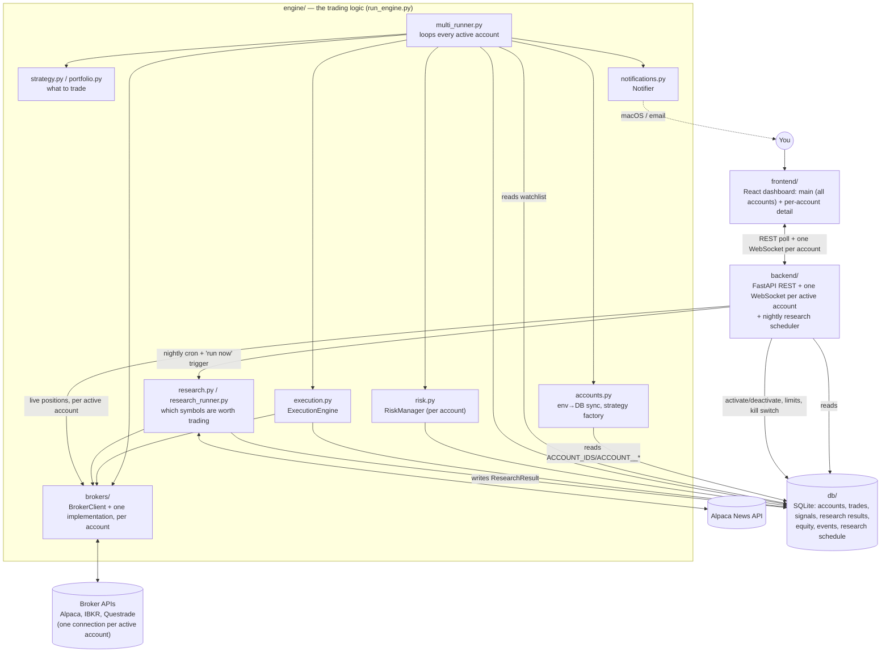

# Architecture

What each part of the codebase does and how they connect. For setup and day-to-day
usage, see [README.md](README.md).

## Overview

The engine (`run_engine.py`) is the only thing that talks to a broker for trading. Each
cycle it loops over every account the dashboard has marked active, builds that account's
own broker connection from its own credentials, and trades it with whatever strategy
it's assigned — one account's failure never blocks the others. The backend never places
orders — it only reads history from the database and makes one read-only live call per
active account's broker for current positions. The frontend never talks to a broker or
the database directly — everything goes through the backend. This keeps the loop that
actually risks money small and auditable: one path in, through `multi_runner.py`,
everything else is observation. The backend also *invokes*
`research_runner.research_once()` directly — on its own nightly schedule (unless the
dashboard's toggle disables it) and via the dashboard's "Run research now" button — but
`research_once` only ever screens candidates and never calls `submit_market_order`, so
it's on the observation side of that line, not the trading side, even though the backend
is the one calling it. Which broker each account actually talks to, and which strategy it
trades, are per-account `.env`/dashboard settings — see below.

## `engine/` — the trading logic

### `config.py`

Loads `.env` into two shapes: a `Config` dataclass for genuinely global settings
(default risk limits used only to seed a new account, SMTP, the research news API key
pair), and a per-account `AccountCredentials` dataclass for broker selection + that
broker's auth fields. This split is the literal implementation of "broker information is
separated from account key/secret" — before multi-account support there was one global
`BROKER` env var and one set of `alpaca_*`/`ibkr_*`/`questrade_*` fields; now there's one
`AccountCredentials` per account, built by `load_account_credentials(account_id)` reading
`ACCOUNT_<id>_*` vars, and `load_account_ids()` reading the comma-separated `ACCOUNT_IDS`
var that lists which accounts exist at all.

Each broker's fields live alongside `AccountCredentials.broker`, not behind a shared
shape: `alpaca_api_key`/`alpaca_secret_key`, `ibkr_host`/`ibkr_port`/`ibkr_client_id`,
`questrade_refresh_token` are three genuinely different auth models (API key pair,
a local socket connection with no key at all, an OAuth refresh token), not one
generic `broker_api_key` field with per-broker interpretation. Adding a fourth
broker means adding its own `<name>_*` fields, not fitting it into an existing shape.

`load_account_credentials()` does one piece of resolution rather than a straight env-var
copy: Alpaca paper and live are separate accounts with separate keys, so an account's
`.env` block holds both pairs (`ACCOUNT_<id>_ALPACA_API_KEY`/`_ALPACA_SECRET_KEY` and
`ACCOUNT_<id>_ALPACA_LIVE_API_KEY`/`_ALPACA_LIVE_SECRET_KEY`), and the function picks the
pair matching that account's own `_ALPACA_PAPER` value - by the time `AlpacaBroker` sees
`credentials.alpaca_api_key`, it's already the right one, and flipping one account to
live never touches another account's keys.

### `brokers/` — the only place that talks to a broker's SDK/API

- **`base.py`** defines `BrokerClient`, a `Protocol` (interface) with everything the
  rest of the app needs from a broker: `get_account`, `get_clock`, `get_bars`,
  `get_position_qty`, `get_positions`, `submit_market_order`. Also defines the plain
  dataclasses those methods return (`AccountSnapshot`, `PositionSnapshot`, etc.) and
  a `Timeframe` enum — none of them are broker-specific types.
- **`alpaca_broker.py`** implements `BrokerClient` using the `alpaca-py` SDK — the
  only file that imports `alpaca-py`. **Verified working**: connected to a real
  paper account, placed real (paper) trades, confirmed via the dashboard.

  `get_bars(symbol, timeframe, limit)` (no explicit `start`, the shape every caller
  in this codebase actually uses) does *not* pass `limit` straight through to
  Alpaca. Confirmed against a real account: Alpaca's `/v2/stocks/bars` defaults
  `start` to ~today when omitted, not "the last `limit` bars" — so on any day
  today's bar hasn't published yet (weekends, before close), a `limit`-only request
  silently returns **zero bars**, and this affected every live caller
  (`multi_runner.py`, `research_runner.py`). `_default_start()`
  computes an explicit calendar-day window wide enough to cover `limit` trading
  days (accounting for weekends plus a holiday buffer). That window is then
  fetched *unbounded* rather than also passing `limit` to Alpaca, because its
  default `sort` is ascending — passing `limit` alongside a synthesized `start`
  would return the **oldest** bars in the window, not the most recent ones (this
  would have silently broken the rebalancer's "get the latest close price"
  use case, `get_bars(symbol, Timeframe.DAY, limit=1)`, returning a stale price
  from weeks back instead). `get_bars` takes `.tail(limit)` client-side instead.
  An explicit `start` (the only way `scripts/common.py`'s backtest fetcher calls
  it) skips all of this and behaves exactly as before.
- **`ibkr_broker.py`** implements `BrokerClient` via `ib_async`. Connects to a
  locally running Trader Workstation or IB Gateway over its API socket — there's no
  API key, you authenticate by being logged into TWS/Gateway yourself. Two pure
  helper functions are factored out specifically because the rest of the class
  can't be exercised without a live connection: `_parse_trading_hours` (IB's
  `ContractDetails.tradingHours` string format, used for `get_clock`) and
  `_duration_string` (builds the duration string `reqHistoricalData` expects).
  **Untested against a live connection** — no TWS/Gateway instance was available
  while writing it. Method and field names were checked against the installed
  `ib_async` package's actual signatures (not just remembered from docs), and the
  translation logic is covered by tests against mocked IB responses, but real
  account behavior needs confirming. Two IBKR accounts sharing one TWS/Gateway
  instance need distinct `ibkr_client_id` values (per-account `AccountCredentials`
  field) — TWS rejects two simultaneous connections on the same client id.
- **`questrade_broker.py`** implements `BrokerClient` via `requests` directly against
  Questrade's REST API (no official Python SDK exists). Handles Questrade's OAuth
  quirk: refresh tokens are single-use and rotate on every refresh, so the token
  from `.env` only has to work once — the current one is cached in
  `questrade_token_<account_id>.json` (gitignored) after that, one file per account so
  two Questrade accounts in one deployment never clobber each other's rotated token
  (`QuestradeBroker.__init__` takes an `account_id` alongside its credentials
  specifically to scope this path). **Untested against a live account** — no Questrade
  account was available while writing it. Endpoint paths and response field names
  (`combinedBalances`, `openPnl`, etc.) are from Questrade's public API documentation,
  covered by tests against mocked HTTP responses matching that documented shape, but
  not verified against a real response.
- **`__init__.py`** exports `make_broker(account_id, credentials)`, which looks up
  `credentials.broker` in a `{"alpaca": ..., "ibkr": ..., "questrade": ...}` map and
  raises immediately on anything else (`account_id` is only actually used to route
  through to `QuestradeBroker`'s per-account token cache — passed to every broker
  regardless so the signature doesn't need to know which brokers care).
  `multi_runner.py`, `execution.py`, and the backend never change regardless of which
  broker a given account is configured for, since they all depend on the
  `BrokerClient` interface, never on a specific broker's types.

### `accounts.py` — turns `.env` into `db.models.Account` rows, and a strategy assignment into a runnable object

- **`sync_accounts_from_env(session, config)`** — for each id in `ACCOUNT_IDS` not yet in
  the database, inserts an `Account` row seeded from that id's `.env` block (broker,
  display name, strategy assignment, and `config`'s default risk limits). For ids already
  present, only `broker`/`display_name` are refreshed — `active`, the strategy
  assignment, the risk limits, and the kill switch are dashboard-owned from that point
  on, so a later `.env` edit to those can't silently revert a change made through the UI.
  Called on every backend/engine startup, and once per `run_all_accounts_once` cycle (so
  a newly-added `ACCOUNT_IDS` entry starts trading on the next cycle without a restart).
- **`build_strategy(strategy_name, strategy_params)`** — factory over the four existing
  strategy shapes: the three `Strategy` subclasses in `strategy.py` (constructed with
  `strategy_params` as kwargs) plus `RebalancingPortfolio` (`strategy_params["target_weights"]`).
  Each account picks one via its `strategy_name`/`strategy_params` columns — this is
  what "each account gets its own strategy assignment" means concretely.
- **`get_active_accounts(session)`** / **`get_all_accounts(session)`** — the read side
  `multi_runner.py` and the backend use to know which accounts to trade/display.
- **`get_research_account(session)`** — the first active account by id, used to resolve
  *a* broker connection for research's market-data fetch (see `research_runner.py` below)
  since research itself isn't account-scoped.

### `strategy.py` — signal-based strategies

Defines the `Strategy` abstract base class: one method, `generate_signal(symbol,
bars) -> (action, reason)`, called independently per symbol. Three concrete
strategies, all long/flat (they buy or hold a position, never short), any of which
an account can be assigned via its `strategy_name`:

| Strategy | Logic | Backtested result (6yr) |
| --- | --- | --- |
| `MovingAverageCrossoverStrategy` | Buy on a golden cross (20-day SMA crosses above 50-day), sell on a death cross | Return 38.9%, Sharpe 0.47, max drawdown -29.1% |
| `MeanReversionStrategy` | Buy when 14-day RSI crosses below 30 (oversold), sell crossing above 70 (overbought) | Return 46.7%, Sharpe 0.50, max drawdown -20.6% |
| `RegimeSwitchingStrategy` | ADX(14) detects trending vs. range-bound; delegates to the crossover strategy when trending, to mean-reversion (with RSI bands that tighten the more range-bound ADX indicates) otherwise | Return 61.9%, Sharpe 0.71, max drawdown -7.4% — but see caveat below |

Buy-and-hold SPY over the same window: return 271.6%, Sharpe 0.795, max drawdown
-34.2%. **All three lost to buy-and-hold on a risk-adjusted basis**, which is why
none of them is any account's default strategy. The regime-switching result looked
the best, but a parameter sweep (`scripts/optimize_regime_switching.py`) showed its
particular ADX settings are an isolated peak surrounded by much worse neighboring
parameters — a classic overfitting signature, not a robust edge.

### `portfolio.py` — the default strategy new accounts are seeded with

`RebalancingPortfolio` is **not** a `Strategy` subclass, deliberately. Rebalancing
needs the whole account state at once — every current position and total equity —
to compute drift from target weights, not one symbol's price history. Forcing it
into the per-symbol `Strategy` interface would have been the wrong abstraction, so
it's a separate, smaller class: give it `target_weights` (e.g. `{"SPY": 1/3, "TLT":
1/3, "GLD": 1/3}`), call `compute_rebalance_orders(account, positions, prices)`, get
back a list of buy/sell orders that correct drift back to target.

Backtested (`scripts/backtest_diversified_portfolio.py`, equal-weight, monthly
rebalance, no timing signals at all): return 166.8%, **Sharpe 0.92** (beating
buy-and-hold's 0.795), max drawdown -22.4% (a third less than buy-and-hold's
-34.2%). This is the one result where more historical data (extending from 3 years
to the full ~10.5 years available) made the result *stronger*, not weaker — the
opposite of what an overfit result does — which is why it's the strategy new
accounts are seeded with (`engine/accounts.py`'s `_DEFAULT_STRATEGY_NAME`) despite
its lower raw return.

No per-symbol dollar cap applies here the way `RiskManager` enforces for the
directional strategies — target weight × equity *is* the position size by
construction. The kill switch and daily loss limit still apply.

### `risk.py` — `RiskManager`

Takes a `Session` and a `db.models.Account` row — limits and kill-switch state come
straight off that row (`account.max_position_size_usd`, `account.max_daily_loss_usd`,
`account.kill_switch_engaged`/`kill_switch_reason`), not a global `Config` and a
separate single-row `KillSwitch` table the way it worked before multi-account support.
Three checks, all reading from the database (via the same SQLAlchemy session the
runner is already using), scoped to `account.id`:

- `kill_switch_engaged()` — reads straight off the `Account` row passed in.
- `daily_loss_limit_breached()` — compares the latest `EquitySnapshot` (filtered to this
  account) against the first one recorded today; `True` if the drop exceeds
  `account.max_daily_loss_usd`. Checked once per cycle for each account by
  `multi_runner.py`, before any signals are generated — a breach halts that *account's*
  entire cycle, not just individual trades, and never affects other accounts.
- `approve(symbol, action, order_value_usd)` — used only by the signal-based strategies,
  checks the kill switch and the per-symbol cap against `account.max_position_size_usd`.
  The portfolio rebalancer doesn't call this (see `portfolio.py` above).

### `execution.py` — `ExecutionEngine`

Takes an approved order, calls `BrokerClient.submit_market_order`, and records the
result as a `Trade` row tagged with the internal `account_id` (`db.models.Account.id`,
what every table now scopes rows by) as well as `broker`/`broker_account_id` (the
broker's own account identifier, kept for display/audit — a separate concept from the
internal id since one is dashboard-facing and stable, the other is whatever string the
broker itself happens to report). On failure, logs a `SystemEvent` (tagged with the same
`account_id`) and fires a notification (via `log_and_notify`) before re-raising — order
failures never fail silently into just a log line.

### `notifications.py` — `Notifier`

Another small interface-plus-implementations pair, same shape as `brokers/`:

- `MacNotifier` — native macOS notification via `osascript`. Zero setup, but only
  fires while this machine is on.
- `EmailNotifier` — SMTP, configured via the `SMTP_*` / `ALERT_EMAIL_*` env vars.
  Supports both STARTTLS (port 587) and implicit TLS (port 465).
- `CompositeNotifier` — fans a single `notify()` call out to a list of notifiers, so
  both fire together.
- `make_notifier(config)` — always includes `MacNotifier`; adds `EmailNotifier` only
  if SMTP settings are present. `config` here is the global `Config` (SMTP settings
  aren't per-account).
- `log_and_notify(session, notifier, level, source, message, account_id=None)` — the
  helper every caller actually uses: writes a `SystemEvent` row (optionally tagged with
  which account it's about — `None` for backend-global events like a failed research run)
  *and* fires the notification in one call, so the event history and the alert can never
  drift apart.

### `multi_runner.py` — the scheduler loop, now over every active account

Replaces the old `runner.py` (signal strategies) + `portfolio_runner.py` (rebalancing) —
those were one broker/account per process, selected by which script you ran
(`run.py`/`run_portfolio.py`) and a `BROKER` env var. `run_all_accounts_once(config)`:

1. Calls `accounts.sync_accounts_from_env` so a freshly-added `ACCOUNT_IDS` entry gets a
   database row without a restart, then `accounts.get_active_accounts` for the list to
   trade this cycle.
2. For each active account, builds that account's own broker connection
   (`make_broker(account.id, load_account_credentials(account.id))`) and dispatches to
   either the signal-strategy path or the rebalance path based on
   `account.strategy_name`, each following the same shape the old two runners did (check
   market clock → open a DB session → check the kill switch → check the daily loss limit
   → do the strategy-specific work → record an `EquitySnapshot`).
3. **One account's exception is caught, logged, and recorded as a `SystemEvent` tagged to
   that account — it never aborts the cycle for other accounts.** This is the concrete
   reason the runner loops per-account inside one `try`/`except` rather than, say,
   spawning one process per account: a bug or a broker outage on one account (out of
   possibly several different brokers) must not stop trading on the others.

Since `_already_rebalanced_this_month` (moved here from the old `portfolio_runner.py`,
now scoped by `account_id`) already makes a monthly rebalance idempotent under repeated
calls, **one** daily `mon-fri 9:35am` `BlockingScheduler` trigger safely drives every
account regardless of whether it's a daily-signal or monthly-rebalance strategy — no need
for the two separate cron schedules (`run.py` daily, `run_portfolio.py` monthly) the
single-account version needed. `main()` also runs one cycle immediately on startup, same
as the old `portfolio_runner.py` did, so a freshly-activated account doesn't wait for the
next scheduled slot. `run_engine.py` is the entrypoint (`run.py`/`run_portfolio.py` are
gone).

### `research.py` / `research_runner.py` — screening a symbol universe

Answers a different question than `strategy.py`: not "buy or sell *this* symbol
*now*", but "which symbols are worth including in that decision at all" — and unlike
everything else in `engine/`, this is **global**, shared by every account assigned a
signal-based strategy, not scoped to one account. Deliberately not a `Strategy`-style
ABC — there are exactly two scorers and no evidence more are coming, so `research.py`
is plain functions rather than a plugin system:

- `score_technical(bars, lookback=60)` — blends lookback return, a return/volatility
  ratio (momentum *quality*, so one wild day doesn't outrank a steady trend), and
  average dollar volume (a liquidity floor) into a 0–100 score, using the same
  `BrokerClient.get_bars` data the strategies already consume.
- `score_news(articles)` — deterministic keyword sentiment (positive/negative word
  lists) plus a coverage-volume bonus, also 0–100. An empty article list scores a
  neutral 50, not 0, so thinly-covered-but-solid names and ETFs aren't punished
  relative to whatever's currently generating headline noise. Same "formula, not ML"
  style as `strategy.py`'s RSI/ADX — has real limits (no negation/sarcasm handling,
  every source treated as equally credible) called out in its docstring.
- `fetch_universe_news(client, universe)` — one Alpaca News API call for the *entire*
  universe (the SDK auto-paginates and accepts a comma-joined symbol list), then
  buckets articles per symbol by checking `article.symbols` membership, since one
  article commonly tags multiple tickers. `make_news_client(config)` uses
  `config.alpaca_news_api_key`/`_secret_key` — a **global** key pair, independent of any
  account's own broker credentials, since research isn't scoped to one account or one
  broker (this used to be the top-level `ALPACA_API_KEY`/`ALPACA_SECRET_KEY`, "read
  unconditionally regardless of `BROKER`" - same idea, just renamed once "regardless of
  BROKER" stopped making sense as a single global concept).
- `combine(technical_score, news_score, technical_weight=0.5, news_weight=0.5)` —
  named float params rather than a `weights` tuple, so a call site can't transpose
  the two by accident.

`research_runner.research_once(universe, top_n, broker, ...)` takes a `BrokerClient` in
rather than building its own — with multiple accounts (possibly multiple brokers) there's
no single "the broker" for it to default to. Both `run_research.py`'s `main()` and the
backend resolve that broker as `engine.accounts.get_research_account`'s pick (the first
active account by id) — a reasonable, deterministic default, not something any account
opts into. It then runs both scorers over every symbol in a fixed, hand-edited universe
(`DEFAULT_UNIVERSE`, defined in `research_runner.py`), writes one `ResearchResult` row per
symbol (not just the winners, so "why wasn't X selected" stays answerable later), and
flags the top `top_n` by `combined_score` as `selected=True`. A per-symbol `try`/`except`
around the bars fetch skips (and logs) symbols with insufficient history or that have
drifted out of the live universe (delisted/renamed), rather than aborting the whole run.

`research_runner.py` itself has no scheduler. `main()` is a one-shot call
(`init_db()` + resolve a broker + `research_once(...)`) — the entrypoint for
`run_research.py`, useful for a manual run or an OS-level cron on a box that doesn't run
the backend persistently. The *automatic* nightly schedule lives in `backend/app/main.py`
instead (see below): the dashboard's toggle and "Run research now" button need to take
effect immediately, and the backend is the one process guaranteed to be running whenever
the dashboard is in use.

One correctness detail worth knowing if you touch this file: `ResearchResult.run_at`
deliberately has **no** column default. `research_once` generates one
`dt.datetime.utcnow()` per run and passes it explicitly to every row, because a
per-row default would give each row a microsecond-different timestamp and silently
break `get_watchlist_symbols`'s "match the latest run" equality query down to at most
one row.

## `db/` — the shared schema

`models.py` defines the tables, written by the engine and/or the backend and read
by the backend:

| Table | What it records |
| --- | --- |
| `Account` | One tradeable account: `broker`/`display_name` (env-owned), `active`/`strategy_name`/`strategy_params`/limits/kill-switch (dashboard-owned after the first sync). Every other table's `account_id` is a foreign key here |
| `Signal` | Every decision a strategy made, whether or not it became a trade — account, symbol, strategy name, action, human-readable reason |
| `Trade` | Every order actually submitted, linked back to the `Signal` that caused it and the `Account` it belongs to |
| `ResearchResult` | Every symbol scored in a research run (not just the ones selected) — technical score, news score, combined score, rationale, and whether it made the cut. Not account-scoped — research is global |
| `EquitySnapshot` | Account equity/cash/buying-power, recorded once per runner cycle per account — this is what the dashboard's equity curve and the daily-loss check both read |
| `SystemEvent` | Errors, kill-switch engagements, daily-loss halts — anything `log_and_notify` was called for. `account_id` is nullable — some events (a research run, a backend startup problem) aren't about one account |
| `ResearchSchedule` | Single-row table; the dashboard's "Run nightly" toggle writes here, the backend's nightly job reads it before each automatic run (the manual "Run research now" button bypasses it) |

There is deliberately no per-account `KillSwitch` table anymore - that state moved onto
`Account.kill_switch_engaged`/`kill_switch_reason` directly, consistent with limits also
living on the `Account` row rather than a separate table each.

`Trade`/`EquitySnapshot` carry both `account_id` (the internal, dashboard-facing id -
what every query actually scopes by) and `broker`/`broker_account_id` (the broker's own
account identifier, kept only for display/audit). These used to be the same concept
(`account_id` was the broker's own id) before multi-account support required a stable
internal id that doesn't depend on broker semantics; `Trade`'s uniqueness constraint is
`(account_id, broker_order_id)` accordingly - one internal account maps to exactly one
broker connection, so this is simpler than the old `(broker, account_id, broker_order_id)`
triple and still correct.

`session.py` provides `init_db()` (creates tables if missing, seeds the one
`ResearchSchedule` row) and `get_session()`. Default is a local SQLite file
(`autotrader.db`); swappable via `DATABASE_URL` to Postgres if the engine and
backend ever need to run on separate machines.

`queries.py` provides `get_watchlist_symbols(session, limit=None)` — the read side
`multi_runner.py` uses for signal-strategy accounts by default: the most recent
`ResearchResult.run_at` batch, filtered to `selected=True`, ordered by `combined_score`
descending. Not account-scoped, since research itself isn't.

**Migrating existing data**: there's no Alembic in this repo, so the jump from the old
single-account schema to this one is a one-off, hand-written migration -
`scripts/migrate_to_accounts.py`. It backs up `autotrader.db` and `.env`, seeds one
`Account` row from the old top-level `.env` values, renames/backfills the old
`trades`/`equity_snapshots`/`signals`/`system_events` tables onto the new
`account_id`/`broker_account_id` split, folds the old single-row `kill_switch` table into
that seeded account, and rewrites `.env` to the new `ACCOUNT_IDS`/`ACCOUNT_<id>_*` shape.

## `backend/` — the API, plus the nightly research scheduler

A single FastAPI app (`backend/app/main.py`). `app.state.accounts` is a
`dict[account_id, AccountRuntime]` — one entry per **active** account, each holding its
own `BrokerClient` and its own `broker_stream.AccountStream` (see below). This replaced
the single `app.state.broker` the backend held before multi-account support; startup
builds one entry per active account, and the activate/deactivate endpoints add/remove
entries at runtime (`_start_account_stream`/`_stop_account_stream`).

Every `GET /accounts/{id}/...` endpoint queries the database directly except
`/accounts/{id}/positions`, which calls that account's `BrokerClient.get_positions()`
live (positions and unrealized P&L need to reflect current prices, not a snapshot) - and
`GET /accounts`, which does the same for every *active* account to build the summary
table's live P&L column in one request. The backend still never places an order itself —
the trading side of the app is still only `multi_runner.py` (see [Overview](#overview)
above).

- `GET /accounts` — every account (active + inactive), with display name, broker,
  strategy, latest equity/cash (from the DB), and live unrealized P&L (active accounts
  only). Powers the main dashboard's table in one call.
- `GET /accounts/{id}` — one account's full detail: limits, strategy, kill-switch state.
- `POST /accounts/{id}/activate` / `/deactivate` — flips `Account.active` and
  starts/stops that account's broker connection + stream.
- `PATCH /accounts/{id}/limits` — writes `max_position_size_usd`/`max_daily_loss_usd`.
- `GET`/`POST /accounts/{id}/kill-switch` — per-account, replacing the old global
  `/kill-switch`.
- `GET /accounts/{id}/positions|equity|trades|signals` — replace the old unscoped
  equivalents; `positions` needs a live connection and 409s for an inactive account.
- `GET /events`, `GET /research`, `GET`/`POST /research/schedule`,
  `GET /research/status`, `POST /research/run` — unchanged in shape, global rather than
  account-scoped (see `research_runner.py` above for why research itself is global).
- `/ws/accounts/{id}` — one WebSocket per account, replacing the old single `/ws`.

Research is the one place the backend does more than read/relay: on startup it
registers an APScheduler `BackgroundScheduler` job (`_nightly_research_job`, 2am
America/New_York) that checks the `ResearchSchedule.enabled` toggle and, if enabled,
resolves a broker via `engine.accounts.get_research_account` (reusing that account's
already-open connection from `app.state.accounts` if the backend has one running, rather
than opening a second one) and calls `research_runner.research_once()` directly. A
module-level `threading.Lock` (`_research_lock`) prevents overlapping runs;
`GET /research/status` exposes whether it's currently held.

`POST /research/run` acquires `_research_lock` synchronously (so two rapid clicks can't
both pass the check), then runs `research_once()` via FastAPI `BackgroundTasks` so the
request returns immediately; `409` if a run is already in progress. Ignores the
`ResearchSchedule` toggle entirely — it's a deliberate manual override, not something
"nightly: off" should block.

This lock/scheduler/`app.state.accounts` is per-process, in-memory — correct for the one
always-on backend instance this app is designed to run as (no process manager, no
multi-worker uvicorn anywhere in this doc). Running multiple backend workers would each
start their own nightly job, lock, and set of broker connections, and isn't supported
today.

No authentication on any endpoint. That's fine bound to `127.0.0.1`; see
[README.md's deployment section](README.md#option-b-an-always-on-servervm) before
exposing it anywhere else.

### `broker_stream.py` — one live-update pipeline per active account

Keeps each active account's equity/cash/positions/trades in sync with its broker in real
time. `AccountStream` (one instance per active account, created/torn down by the backend
alongside that account's broker connection) holds a `BrokerClient.stream()` connection
(or, for Questrade, a simulated poll loop) that tells this module *that* something may
have changed for *that* account; `_reconcile(account_id, broker)` is the one place that
re-fetches the actual truth from that account's broker, writes it to the DB, and pushes it
to every dashboard connected to that account's `/ws/accounts/{id}`. This "dumb signal in,
smart handling once centrally" split (unchanged from before multi-account support) means
the three very different broker event shapes (Alpaca order events, IBKR's several
account/order callbacks, Questrade's plain timer) never need their own bespoke handling
downstream — now just one independent instance of that loop per active account instead of
one for the whole process. `ConnectionManager` is keyed by `account_id` so a broadcast for
one account's reconciliation never reaches a dashboard tab watching a different account.

## `frontend/` — the dashboard

A Vite + React app. `api.ts` is a typed fetch client for every backend endpoint,
including the account-scoped ones. There's no routing library — `router.ts` is a
~30-line hand-rolled `useRoute()`/`navigate()` pair (path from
`window.location.pathname`, a `popstate` listener, `navigate()` via
`history.pushState`), the same call this project already made for `EquityChart.tsx`
(see below): exactly two routes doesn't justify a dependency. `App.tsx` is now just
that router's switch between two top-level pages:

- **`MainDashboard.tsx`** — polls `GET /accounts` (the account summary table),
  `GET /events`, and the research endpoints every 15 seconds. Owns the **`AccountsTable`**
  component (display name, broker, strategy, live equity/cash/unrealized P&L, an
  active/inactive badge, and an activate/deactivate button — clicking a row navigates to
  `/accounts/<id>`), plus the `ResearchPanel` and `EventsFeed` components, both moved here
  from the old single dashboard since neither is account-specific.
- **`AccountDashboard.tsx`** — one account's detail page (`/accounts/<id>`), the
  equivalent of what the old single `App.tsx` showed: `StatTiles`, `EquityChart`,
  `PositionsTable`, `TradesTable`, `SignalsTable`, all now hitting that account's
  `/accounts/{id}/...` endpoints and its own `/ws/accounts/{id}` socket instead of a
  single global set. Also owns `KillSwitchPanel` (now takes `accountId` and calls the
  account-scoped kill-switch endpoints) and the new **`TradingLimitsPanel`** component
  (two number inputs + save, calling `PATCH /accounts/{id}/limits`) — this is where
  "edit account trading limits from the accounts dashboard" actually lives.

Components, each owning one card on one of the two pages:

- **`EquityChart.tsx`** — hand-rolled SVG line chart (not a charting library): a 2px
  round-cap line, hairline gridlines with clean-number ticks, a crosshair that snaps
  to the nearest data point on hover, a value-first tooltip, and a persistent
  end-label showing the latest value. Built to the project's dataviz skill's mark
  specs rather than a library's defaults, which is why it's hand-rolled — small
  enough that doing so was less work than fighting a generic library's styling.
- **`StatTiles.tsx`** — the hero numbers: current equity (with % change since the
  first recorded snapshot), cash, total position value, open position count.
- **`AccountsTable.tsx`**, **`PositionsTable.tsx`**, **`TradesTable.tsx`**,
  **`SignalsTable.tsx`** — plain tables over the corresponding endpoint.
- **`EventsFeed.tsx`** — `SystemEvent` rows with a status color + icon + text label
  per severity (never color alone, so it's still legible without relying on color
  perception).
- **`KillSwitchPanel.tsx`** — the one interactive control on the account page that
  writes anything besides limits: toggles that account's kill switch via
  `POST /accounts/{id}/kill-switch`.
- **`TradingLimitsPanel.tsx`** — edits `max_position_size_usd`/`max_daily_loss_usd` for
  one account.

Theming: CSS custom properties in `index.css`, one block for light and one for dark
(`prefers-color-scheme` plus a `data-theme` attribute override), both instances of
the same validated palette rather than one mode with the other auto-derived.

## `scripts/` — backtesting and migration, not part of the running app

- **`common.py`** — `fetch_daily_bars()`, the one place historical data is pulled
  via `BrokerClient` (whichever broker is configured), shared by every backtest
  script.
- **`backtest_ma_crossover.py`**, **`backtest_mean_reversion.py`**,
  **`backtest_diversified_portfolio.py`** — each reimplements its strategy's logic
  in `backtesting`-library idioms, built to match the live `engine/strategy.py` /
  `engine/portfolio.py` logic exactly (same thresholds, same long/flat behavior, no
  shorting) so results are actually predictive of what the live runner would do.
- **`backtest_regime_switching.py`** — takes a different approach: instead of
  reimplementing the ADX regime logic a third time, its `RegimeSwitchingAdapter`
  calls the *actual* `RegimeSwitchingStrategy.generate_signal()` from
  `engine/strategy.py` at every bar. The composite logic was judged complex enough
  that a from-scratch reimplementation risked silently diverging from what the live
  code does.
- **`optimize_ma_crossover.py`**, **`optimize_regime_switching.py`** — parameter
  sweeps over their respective backtest scripts.
- **`migrate_to_accounts.py`** — one-off migration from the pre-multi-account schema to
  this one; see `db/`'s "Migrating existing data" above. Not part of the running app,
  and not idempotent-by-design the way everything else here is meant to be re-run
  freely — it's meant to run exactly once per deployment, when upgrading.

None of the backtest scripts touch the live database or place real orders — they only
read historical market data and print/plot results.

## `tests/` — no network or credentials required

124 tests, all against synthetic data, in-memory/temp-file SQLite, or mocked
network/socket calls — no live broker credentials or network access needed to run
any of them:

- `test_strategy.py` — crossover/RSI/regime-switching signal logic on constructed
  price series (e.g. a flat-then-jump series to force an exact golden-cross bar).
- `test_portfolio.py` — `RebalancingPortfolio`'s drift-correction math.
- `test_multi_runner.py` — the per-account monthly-rebalance guard (including that one
  account's signal never counts toward another account's guard), that one account's
  exception during `run_all_accounts_once` never blocks the others, and that `main()`
  validates config before starting the scheduler.
- `test_research.py` — `score_technical`/`score_news`'s pure scoring math (uptrend vs.
  flat, liquid vs. illiquid, neutral-on-no-news, positive/negative keyword lean).
- `test_research_runner.py` — `get_watchlist_symbols` against an in-memory DB: no
  runs yet, only-the-latest-run, unselected rows excluded, score ordering, `limit`.
- `test_backend.py` — the `/accounts*` and `/research*` endpoints via FastAPI's
  `TestClient` against a temp-file SQLite (`db.session.engine`/`SessionLocal`
  monkeypatched, since the backend has no DI seam for its session today) with the real
  `BackgroundScheduler` and per-account broker streams swapped for no-ops: account
  list/detail/activate/deactivate/limits/kill-switch round-trip, live unrealized P&L
  only for accounts with a runtime broker registered, 409 on positions for an inactive
  account, schedule toggle round-trips, latest-run ordering, `/research/status`
  reflecting `_research_lock`, and `POST /research/run` returning 409 while a run is
  already in progress.
- `test_broker_stream.py` — `_reconcile`'s DB writes and trade upsert logic scoped by
  `account_id` (including that a same `broker_order_id` under a different account is
  never matched), and `ConnectionManager.broadcast` only reaching the connections
  registered for that account.
- `test_risk.py` — `RiskManager`'s kill-switch, daily-loss, and position-cap checks,
  all against a `db.models.Account` row rather than a global config.
- `test_notifications.py` — `Notifier` composition and that failures (a bad SMTP
  host, a failing `osascript` call) are swallowed rather than crashing the runner.
- `test_config.py` — `load_account_credentials()` picks the paper vs. live Alpaca key
  pair correctly per account, and that two accounts' fields (including two IBKR
  accounts' client ids) never leak into each other.
- `test_brokers.py` — `make_broker()` returns the right class per account's `broker`
  value, raises clearly on an unsupported one, and scopes Questrade's token cache path
  by `account_id`.
- `test_alpaca_broker.py` — `_default_start`'s calendar-day math, and that
  `get_bars()` fetches an unbounded window and takes the tail itself when `start`
  is omitted rather than trusting Alpaca's own `limit` (see `alpaca_broker.py`'s
  entry under `brokers/` above) - plus that an explicit `start` (the backtest
  path) is untouched.
- `test_ibkr_broker.py` — the `_parse_trading_hours` / `_duration_string` pure
  helpers, plus response-translation logic against a mocked `IB` connection
  (`SimpleNamespace` fakes shaped like `ib_async`'s real objects, not a live TWS).
- `test_questrade_broker.py` — request/response translation, the refresh-token
  rotation behavior against mocked HTTP responses, and that two accounts' token
  caches are fully independent - not verified against a live Questrade account.

## Why things are split up this way

A few decisions that aren't obvious from reading any single file in isolation:

- **`BrokerClient` was built before there was a second broker, and it held up
  without changes once IBKR and Questrade were added - and again once multiple
  accounts (possibly on the same broker) were added.** The interface seam was
  worth building early specifically because Alpaca-specific types had already
  leaked into `execution.py`, `runner.py`, and the backend once, before the
  refactor — the cost of *not* having the interface was concrete, not
  hypothetical. Multi-account support confirmed the bet a second time: `multi_runner.py`,
  `execution.py`, and the backend needed no changes to `BrokerClient` itself, only
  to *how many* broker connections they hold at once and which account each is tagged
  with.
- **Multi-account support is a per-account credentials + per-account database row
  change, not a "tenant" abstraction.** There's no `Broker` table separate from
  `Account`, and no shared-broker-definition-reused-by-many-accounts model - each
  account fully owns its own `AccountCredentials` (read from its own `.env` block) and
  its own `Account` row. This matches the actual requirement (accounts, not
  organizations or users) without inventing multi-tenancy machinery nothing here needs.
- **Credentials stay in `.env`, not the database.** The database holds everything a
  dashboard reasonably edits at runtime (active flag, strategy, limits, kill switch) -
  secrets stay in the same place they always have, consistent with this app's existing
  no-auth/localhost-only threat model, and sidesteps needing an encryption-at-rest story
  for a hobby-scale local deployment.
- **IBKR and Questrade were built without an account to test against.** Both were
  written to their SDK's/API's documented behavior, with method and field names
  checked against what's actually installed where possible (`ib_async`'s real
  signatures were inspected directly), and covered by tests against mocked
  responses. That's a meaningfully weaker guarantee than Alpaca's, which was
  connected to a real paper account and had real trades verified end-to-end
  through the dashboard. Treat `ibkr_broker.py` and `questrade_broker.py` as a
  well-researched starting point, not as verified the way `alpaca_broker.py` is,
  until someone runs them against a real TWS/Gateway instance and a real
  Questrade account.
- **`RebalancingPortfolio` is not a `Strategy`.** Two different data shapes
  (whole-account state vs. one symbol's bars) that happen to both produce
  buy/sell decisions is not the same interface — see `portfolio.py` above.
- **One daily scheduler trigger drives every account, regardless of strategy
  cadence.** Before multi-account support, `run.py` (daily) and `run_portfolio.py`
  (monthly) were separate processes with separate cron schedules. Once a single
  process could hold accounts on both cadences at once, the simplest correct fix was
  relying on the already-idempotent `_already_rebalanced_this_month` guard rather than
  maintaining two schedules - a monthly-strategy account checked daily just no-ops on
  all but the days it actually needs to act.
- **Backtests call the real strategy code where feasible, and mirror it carefully
  where they can't.** `backtest_regime_switching.py`'s adapter pattern (call the
  actual class) is preferred over `backtest_ma_crossover.py`'s reimplementation
  pattern (match the logic by hand) — the latter exists only because
  `backtesting`'s vectorized indicator style made calling the live class directly
  awkward for the simpler strategies, not because reimplementation is the better
  default.
- **The daily-loss check moved out of `RiskManager.approve()`.** It used to live
  there, silently rejecting individual buy signals one at a time. That technically
  worked but never actually "halted trading" the way the design called for, and
  never got recorded anywhere. It's now a single `daily_loss_limit_breached()` check
  the runner calls once per account per cycle, paired with `log_and_notify` — found and
  fixed while building the alerting system, not part of the original design.
